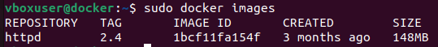
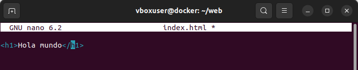
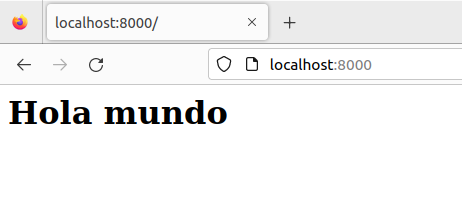
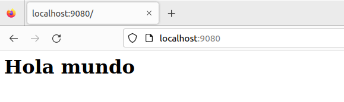
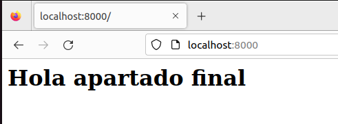

# Tarea3SXE

### En esta tarea se realizaran una serie de tareas especificadas a continuacion con los respectivos pasos para hacerlas correctamente.

#### 1. Descarga la imagen 'httpd' y comprueba que está en tu equipo.

##### Para descargar la imagen httpd con el tag 2.4 primero deberemos utilizar el siguiente comando
```
docker pull httpd:2.4     #Copiar para instalar la imagen
```
##### Para comprbar que esta utilizaremos el siguiente comando
```
docker images     #Copiar para revisar las imagenes de docker instaladas
```



#### 2. Crea un contenedor con el nombre 'dam_web1'.

##### Para crear un contenedor debemos utilizar el siguiente comando
```
docker run -d --name dam_web1 httpd:2.4     #Copiar para crear el contedor
                                            #Cambiar el nombre en caso de necesitarlo
```

#### 3. Si quieres poder acceder desde el navegador de tu equipo, ¿que debes hacer?

##### Para acceder desde navegador primero debemos borrar el contenedor ya creado y crear uno nuevo con un puerto asignado

```
docker stop dam_web1 y docker rm dam_web1    #Copiar para borrar el contenedor
docker run -d --name dam_web1 -p 8000:80 httpd:2.4     #Copiar para crear el contenedor con un puerto asigado
```
#### 4. Utiliza bind mount para que el directorio del apache2 'htdocs' esté montado un directorio que tu elijas.

##### Primero deberemos crear un directorio
```
mkdir /home/vboxuser/web     #Copiar para crear el directorio
```

##### A continuacion deberemos crear el contenedor con el directorio con el siguiente comando, borrando previamente el anterior para poder crearlo de nuevo
```
docker run -d --name dam_web1 -p 8000:80 -v /home/vboxuser/web:/usr/local/apache2/htdocs httpd:2.4   #Copiar para crear el contenedor con puerto y fichero asignados
```

#### 5. Realiza un 'hola mundo' en html y comprueba que accedes desde el navegador

##### Primero deberemos crear un archivo index.html en el directorio creado anteriormente, para ello nos colocaremos dentro de el directorio y ponemos el siguiente comando
```
nano index.html    #Copiar para crear el archivo.html
```
##### Al crearlo nos saldra al siguiente interfaz donde pondremos la siguiente estructura para crear un encabezado de hola mundo



##### A continuacion pegamos en el navegador la direccion http://localhost:8000 para comprobar que funciona



#### 6. Crea otro contenedor 'dam_web2' con el mismo bind mount y a otro puerto, por ejemplo 9080.

##### Para crear este otro contenedor deberemos hacer el mismo comando que anteriormente cambiando el puerto y el nombre del contenedor
```
docker run -d --name dam_web2 -p 9080:80 -v /home/vboxuser/web:/usr/local/apache2/htdocs httpd:2.4    #Copiar para crear el contenedor con el nuevo nombre y puerto
```
#### 7. Comprueba que los dos servidores 'sirven' la misma página, es decir, cuando consultamos en el navegador

##### Comprobamos que funciona coomo en el apartado anateior cambiando el puerto de la ruta http://localhost:9080 y las 2 muestran el mismo hola mundo



#### 8. Realiza modificaciones de la página y comprueba que los dos servidores 'sirven' la misma página

#### Volvemos a modificarlo con el mismo comando que anteriormente y comprobamos en el navegador que funciona
```
nano index.html       #Copiar para modificar el archivo
```




